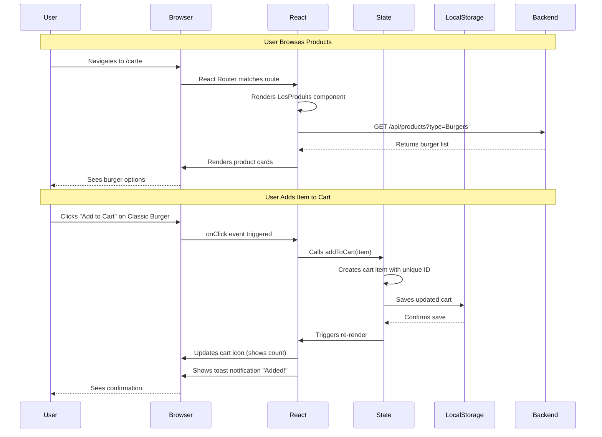
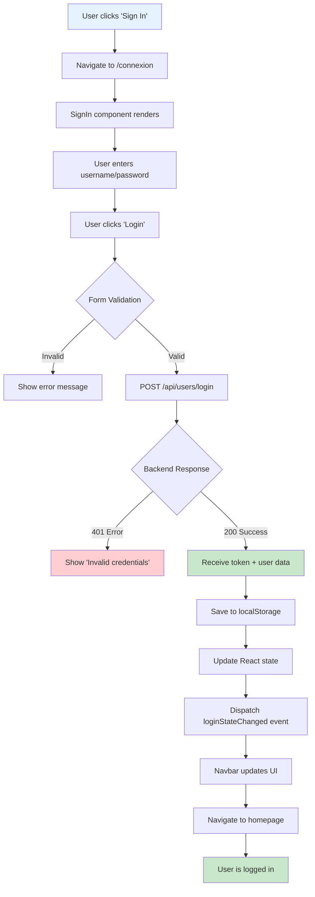
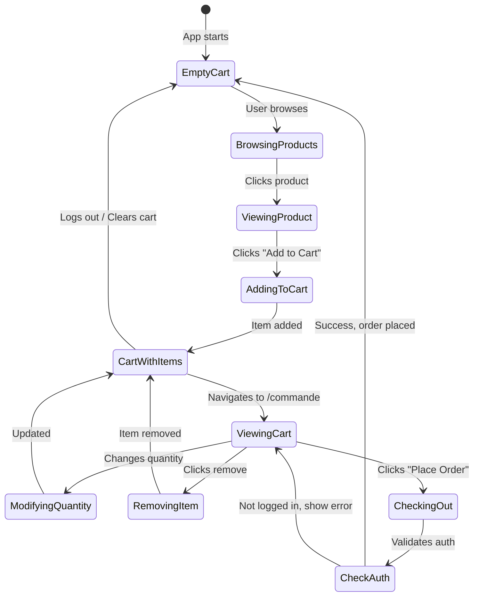
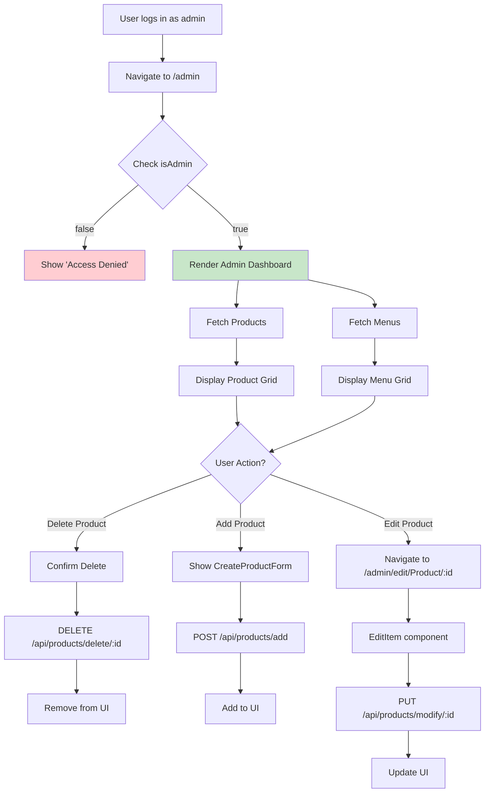
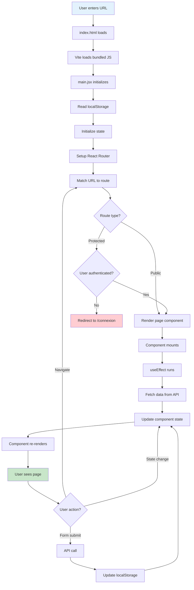
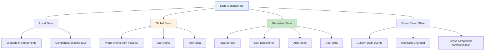

# Burger Town - Frontend Application

## Table of Contents
- [Overview](#overview)
- [How the Frontend Works - Complete Guide](#how-the-frontend-works---complete-guide)
- [Architecture](#architecture)
- [Technology Stack](#technology-stack)
- [Project Structure](#project-structure)
- [Pages and Components](#pages-and-components)
- [State Management](#state-management)
- [API Integration](#api-integration)
- [Routing System](#routing-system)
- [Installation](#installation)
- [Deployment](#deployment)
- [Important Notes](#important-notes)

---

## Overview

The **Burger Town** frontend is a modern web application built with **React** and **Vite**. It provides an intuitive and responsive user interface for ordering burgers, browsing the menu, managing user accounts, and administering the restaurant.

**Key Features:**
- Smooth navigation with React Router
- Interactive product and menu catalog
- Dynamic shopping cart with persistence (localStorage)
- User authentication (login/registration)
- Admin dashboard for managing products and menus
- Responsive interface (mobile, tablet, desktop)
- Animations with Framer Motion
- Notifications with React Toastify

---

## How the Frontend Works - Complete Guide

### 1. Frontend's Role in the Application Ecosystem

The frontend is the **user-facing layer** of the application, responsible for presenting data and handling user interactions.

```
┌─────────────────────────────────────────────────────────────┐
│                    COMPLETE ARCHITECTURE                     │
└─────────────────────────────────────────────────────────────┘

User (Browser)
  │ Device: Desktop, Tablet, Mobile
  │ Location: Anywhere with internet
  │
  ├─ Sees: HTML + CSS rendered interface
  ├─ Interacts: Clicks buttons, fills forms
  └─ Experiences: Smooth animations, instant feedback
      │
      ↓ User Actions (clicks, form submissions)
      │
Frontend Application (React + Vite)  ← YOU ARE HERE
  │ Hosted on Vercel
  │ https://burger-house-front.vercel.app
  │
  ├─ React Components (UI building blocks)
  ├─ State Management (useState, localStorage)
  ├─ React Router (page navigation)
  └─ API calls (fetch/axios to backend)
      │
      ↓ HTTP Requests (GET, POST, PUT, DELETE)
      │
Backend API (Node.js + Express)
  │ Hosted on Fly.io
  │ https://burger-house-back.fly.dev
  │
  └─ Processes requests and returns data
      │
      ↓ Database queries
      │
MongoDB Atlas (Cloud Database)
  │ Stores: Products, Menus, Orders, Users
  │
  └─ Returns: JSON data
      │
      ↓ Data flows back up
      │
Frontend receives data → Updates UI → User sees changes
```

### 2. Component Lifecycle - Complete Example

**Scenario: User wants to add a burger to their cart**



**Step-by-Step Breakdown:**
```
STEP 1: Initial Page Load
─────────────────────────
User types: https://burger-house-front.vercel.app/carte
Browser requests HTML from Vercel

STEP 2: React Hydration
────────────────────────
1. Browser loads index.html
2. Loads bundled JavaScript (main.jsx)
3. React initializes:
   - Reads localStorage for saved state
   - Sets up router
   - Mounts App component

STEP 3: Route Matching
───────────────────────
React Router sees /carte URL
Finds matching route: <Route path="/carte" element={<Carte />} />
Renders Carte component

STEP 4: Component Mounting
───────────────────────────
Carte.jsx mounts:
1. Initializes state: const [products, setProducts] = useState([])
2. useEffect runs: fetches products from API
3. Updates state when data arrives
4. Re-renders with product list

STEP 5: User Interaction
─────────────────────────
User clicks "Add to Cart" button
onClick={

() => addToCart(product)} triggers

STEP 6: State Update
─────────────────────
addToCart function (in main.jsx):
1. Creates cart item:
   {
     uniqueId: nextUniqueId,
     itemRef: product._id,
     onModel: "Product",
     quantity: 1,
     price: product.price
   }
2. Updates cartItems array
3. Increments nextUniqueId
4. Triggers useEffect

STEP 7: Persistence
────────────────────
useEffect detects cartItems change:
localStorage.setItem("cartItems", JSON.stringify(cartItems))

STEP 8: UI Feedback
────────────────────
1. React re-renders components with updated cartItems
2. Navbar shows new cart count
3. Toast notification appears: "Item added to cart!"
4. User sees visual confirmation
```

### 3. Authentication Flow - How It Works



**A. Registration Flow:**
```
User Registration Journey
─────────────────────────

1. User navigates to /inscription
   └─ CreateAccount.jsx renders

2. User fills out form:
   - Username (unique identifier)
   - Password (min 8 characters)
   - Name, Surname
   - Email (for password recovery)
   - Phone, Address, Zipcode, City
   - Date of Birth

3. Client-side validation:
   if (!username || !password) {
     setError("All fields required");
     return;
   }

4. Form submission:
   const response = await fetch(`${API_URL}/api/users/register`, {
     method: 'POST',
     headers: { 'Content-Type': 'application/json' },
     body: JSON.stringify(formData)
   });

5. Backend validates and creates user:
   - Checks username uniqueness
   - Hashes password with bcrypt
   - Saves to MongoDB

6. Success response:
   - toast.success("Account created!")
   - navigate('/connexion')
   - User must log in manually

7. Error handling:
   - Shows specific error messages
   - Form stays populated
   - User can correct and resubmit
```

**B. Login Flow:**
```
User Login Journey
──────────────────

1. User navigates to /connexion
   └─ SignIn.jsx renders

2. User enters credentials:
   - Username OR Email (smart detection)
   - Password

3. Smart username detection:
   const loginData = {
     ...(username.includes("@")
       ? { email: username }
       : { username }),
     password
   };

4. API call:
   POST /api/users/login
   └─ Backend validates credentials

5. Success response contains:
   {
     token: "eyJhbGciOiJIUzI1NiIs...",
     user: {
       _id: "...",
       username: "john_doe",
       email: "john@example.com",
       isAdmin: false,
       name: "John",
       ...
     }
   }

6. Frontend saves data:
   localStorage.setItem("userToken", token);
   localStorage.setItem("user", JSON.stringify(user));

7. Update application state:
   - setUser(user) in main.jsx
   - Fetches user's cart from backend
   - Dispatches custom event

8. UI updates globally:
   - Navbar shows "My Account" link
   - Admin badge appears (if admin)
   - Cart syncs with backend
```

**C. Session Persistence:**
```
App Initialization (on page load)
──────────────────────────────────

main.jsx runs initialization code:

// Check for saved user
const [user, setUser] = useState(() => {
  const savedUser = localStorage.getItem("user");
  return savedUser ? JSON.parse(savedUser) : null;
});

// Check for saved cart
const [cartItems, setCartItems] = useState(() => {
  const savedCart = localStorage.getItem("cartItems");
  return savedCart ? JSON.parse(savedCart) : [];
});

Result:
- User stays logged in across browser sessions
- Cart persists even after closing browser
- Token remains valid for 7 days (JWT expiration)
```

**D. Logout Flow:**
```
User Logout Journey
───────────────────

1. User clicks "Logout" in Navbar
   └─ handleLogout() called

2. Clear all authentication data:
   localStorage.removeItem("userToken");
   localStorage.removeItem("user");
   localStorage.removeItem("cartItems");

3. Clear React state:
   setUser(null);
   clearCart();

4. Notify all components:
   window.dispatchEvent(
     new CustomEvent("loginStateChanged", { detail: null })
   );

5. UI updates:
   - Navbar shows "Sign In" link
   - Admin badge disappears
   - Protected routes become inaccessible
   - Cart empties

6. Navigate to homepage:
   navigate('/');
```

### 4. Shopping Cart - Complete Workflow



**Adding Items to Cart:**
```
Product Page → Add to Cart Button Click
───────────────────────────────────────

Produit.jsx component:

1. User selects quantity (1-10 with +/- buttons)
   const [quantity, setQuantity] = useState(1);

2. Calculates price:
   const totalPrice = (item.price * quantity).toFixed(2);

3. Creates cart item structure:
   const cartItem = {
     itemRef: item._id,              // Reference to product
     onModel: "Product",             // Type identifier
     quantity: quantity,             // How many
     price: item.price,              // Unit price
     title: item.title,              // Display name
     imageSrc: item.imageSrc,        // Image URL
   };

4. Calls addToCart function (from main.jsx):
   addToCart(cartItem);

5. addToCart function logic:
   const addToCart = (item) => {
     const newItem = {
       ...item,
       uniqueId: nextUniqueId  // Unique identifier for this cart entry
     };

     setCartItems(prev => [...prev, newItem]);
     setNextUniqueId(prev => prev + 1);

     toast.success("Item added to cart!");
   };

6. useEffect triggers:
   useEffect(() => {
     localStorage.setItem("cartItems", JSON.stringify(cartItems));
   }, [cartItems]);

7. Result:
   - Cart updated in memory (React state)
   - Cart saved to localStorage (persistence)
   - User sees toast notification
   - Navbar cart icon updates count
```

**Menu Customization:**
```
Menu Page → Custom Menu Builder
────────────────────────────────

Menu.jsx component (more complex):

1. User lands on /menu/:menuId
   - Component fetches menu details from API
   - Fetches all products for each category

2. Menu structure loaded:
   {
     _id: "menu123",
     title: "Classic Menu",
     price: 12.99,
     products: [productId1, productId2, ...]  // References
   }

3. User makes selections:
   a) Size selection:
      <select value={selectedOptions.size}>
        <option value="medium">Medium</option>
        <option value="large">Large (+€0.90)</option>
      </select>

   b) Product selections by category:
      - Drinks (Boissons)
      - Sides (Accompagnements)
      - Sauces
      - Ice Cream (Glaces)

4. State management:
   const [selectedOptions, setSelectedOptions] = useState({
     size: "medium",
     Boissons: null,
     Accompagnements: null,
     Sauces: null,
     Glaces: null
   });

5. Price calculation:
   const calculateTotalPrice = () => {
     let total = menuDetails.price;
     if (selectedOptions.size === "large") {
       total += 0.90;
     }
     return total.toFixed(2);
   };

6. Add customized menu to cart:
   const cartItem = {
     itemRef: menuDetails._id,
     onModel: "Menu",
     quantity: 1,
     price: calculateTotalPrice(),
     selectedOptions: { ...selectedOptions },  // Save choices
     title: menuDetails.title,
     imageSrc: menuDetails.imageSrc
   };

7. Cart displays:
   - Menu name
   - Expandable details showing all selections
   - "Modify" button to change selections
```

**Cart Management:**
```
CartAndOrderSummary.jsx Component
──────────────────────────────────

1. Data Hydration Process:

   Problem: Cart only stores IDs, not full details

   Solution: Fetch full details for each item

   const hydrateCartItems = async () => {
     const enrichedItems = await Promise.all(
       cartItems.map(async (cartItem) => {
         // Fetch full product/menu details
         const itemDetails = await getItemById(
           cartItem.onModel,
           cartItem.itemRef
         );

         // For menus, resolve selected option IDs to full product data
         if (cartItem.onModel === "Menu" && cartItem.selectedOptions) {
           const resolvedOptions = {};

           for (const [category, productId] of Object.entries(cartItem.selectedOptions)) {
             if (category !== "size") {
               const product = await getItemById("Product", productId);
               resolvedOptions[category] = product;
             }
           }

           return {
             ...itemDetails,
             ...cartItem,
             resolvedOptions
           };
         }

         return { ...itemDetails, ...cartItem };
       })
     );

     setItemsWithDetails(enrichedItems);
   };

2. Display cart items:
   {itemsWithDetails.map(item => (
     <div key={item.uniqueId} className="cart-item">
       
       <div className="item-details">
         <h3>{item.title}</h3>
         <p>Quantity: {item.quantity}</p>
         <p>Price: €{(item.price * item.quantity).toFixed(2)}</p>

         {/* For menus, show expandable details */}
         {item.onModel === "Menu" && (
           <div className="menu-options">
             <p>Size: {item.selectedOptions.size}</p>
             <p>Drink: {item.resolvedOptions.Boissons?.title}</p>
             <p>Side: {item.resolvedOptions.Accompagnements?.title}</p>
             {/* ... */}
           </div>
         )}

         <button onClick={() => removeItemFromCart(item.uniqueId)}>
           Remove
         </button>
       </div>
     </div>
   ))}

3. Calculate total:
   const calculateTotal = () => {
     return itemsWithDetails.reduce((sum, item) => {
       return sum + (item.price * item.quantity);
     }, 0).toFixed(2);
   };

4. Place order:
   const handlePlaceOrder = async () => {
     // Check authentication
     if (!user) {
       toast.error("Please log in to place an order");
       navigate('/connexion');
       return;
     }

     // Prepare order payload
     const orderPayload = {
       items: cartItems.map(item => ({
         itemRef: item.itemRef,
         onModel: item.onModel,
         quantity: item.quantity,
         selectedOptions: item.selectedOptions || {}
       })),
       totalPrice: parseFloat(calculateTotal())
     };

     // Submit to backend
     const authToken = localStorage.getItem("userToken");
     const response = await fetch(`${API_URL}/api/orders/add`, {
       method: 'POST',
       headers: {
         'Content-Type': 'application/json',
         'Authorization': `Bearer ${authToken}`
       },
       body: JSON.stringify(orderPayload)
     });

     if (response.ok) {
       // Success
       clearCart();
       toast.success("Order placed successfully!");
       navigate('/orderconfirmation');
     } else {
       // Error handling
       const error = await response.json();
       toast.error(error.message || "Failed to place order");
     }
   };
```

### 5. Admin Dashboard - Management Interface



**Admin Access Control:**
```
Protection Pattern
──────────────────

Admin.jsx component:

1. Check user authentication and role:
   const user = JSON.parse(localStorage.getItem("user"));

   if (!user || !user.isAdmin) {
     return (
       <div className="not-allowed">
         <h2>Access Denied</h2>
         <p>You need administrator privileges</p>
       </div>
     );
   }

2. Role assignment:
   - Only backend can set isAdmin: true
   - User can't self-promote to admin
   - Admin status verified on every API call

3. Protected API endpoints:
   fetch(url, {
     headers: {
       'Authorization': `Bearer ${authToken}`
     }
   });

   Backend middleware checks:
   - Is token valid?
   - Does user exist?
   - Is user.isAdmin === true?
```

**CRUD Operations:**
```
Create Product Flow
───────────────────

1. Admin clicks "Add Product" button
   └─ setShowProductForm(true)

2. CreateProductForm.jsx renders:
   <form onSubmit={handleSubmit}>
     <input name="title" />
     <input name="price" type="number" />
     <select name="type">
       <option>Burgers</option>
       <option>Boissons</option>
       {/* ... */}
     </select>
     <input name="imageSrc" />
     <textarea name="description" />
   </form>

3. Form submission:
   const handleSubmit = async (e) => {
     e.preventDefault();

     const authToken = localStorage.getItem("userToken");
     const newProduct = await createProduct(productData, authToken);

     // Optimistic UI update
     setProducts(prev => [...prev, newProduct]);

     // Close form
     setShowProductForm(false);

     toast.success("Product created!");
   };

4. API call (frontFunctions.js):
   export const createProduct = async (productData, authToken) => {
     const response = await fetch(`${API_URL}/api/products/add`, {
       method: 'POST',
       headers: {
         'Content-Type': 'application/json',
         'Authorization': `Bearer ${authToken}`
       },
       body: JSON.stringify(productData)
     });

     if (!response.ok) throw new Error("Failed to create");
     return response.json();
   };

Edit Product Flow
─────────────────

1. Admin clicks "Edit" button
   └─ navigate(`/admin/edit/Product/${product._id}`)

2. EditItem.jsx component:
   - Fetches current product data
   - Pre-fills form with existing values
   - Allows modifications

3. Submit changes:
   const handleUpdate = async (e) => {
     e.preventDefault();

     await updateProduct(itemId, updatedData, authToken);

     toast.success("Product updated!");
     navigate('/admin');
   };

Delete Product Flow
───────────────────

1. Admin clicks "Delete" button
   └─ Confirmation dialog appears

2. Confirm deletion:
   const handleDelete = async (productId) => {
     if (!window.confirm("Delete this product?")) return;

     await deleteProduct(productId, authToken);

     // Remove from UI immediately
     setProducts(prev => prev.filter(p => p._id !== productId));

     toast.success("Product deleted!");
   };

3. Backend cascade delete:
   - Removes product from database
   - Updates any menus referencing it
   - Existing orders maintain reference (for history)
```

### 6. Responsive Design - Multi-Device Support

```
Desktop Layout (1024px+)
────────────────────────
┌─────────────────────────────────────────────────────┐
│ Navbar: Logo | Links | Search | Cart | Account     │
├─────────────────────────────────────────────────────┤
│                                                     │
│  ┌──────┐ ┌──────┐ ┌──────┐ ┌──────┐ ┌──────┐    │
│  │ Prod │ │ Prod │ │ Prod │ │ Prod │ │ Prod │    │
│  │  1   │ │  2   │ │  3   │ │  4   │ │  5   │    │
│  └──────┘ └──────┘ └──────┘ └──────┘ └──────┘    │
│  ┌──────┐ ┌──────┐ ┌──────┐ ┌──────┐ ┌──────┐    │
│  │ Prod │ │ Prod │ │ Prod │ │ Prod │ │ Prod │    │
│  │  6   │ │  7   │ │  8   │ │  9   │ │  10  │    │
│  └──────┘ └──────┘ └──────┘ └──────┘ └──────┘    │
│                                                     │
├─────────────────────────────────────────────────────┤
│ Footer: Links | Social Media | Contact             │
└─────────────────────────────────────────────────────┘

Tablet Layout (768px - 1023px)
───────────────────────────────
┌──────────────────────────────┐
│ Navbar: Logo | ☰ Menu        │
├──────────────────────────────┤
│                              │
│  ┌────────┐ ┌────────┐      │
│  │        │ │        │      │
│  │ Prod 1 │ │ Prod 2 │      │
│  │        │ │        │      │
│  └────────┘ └────────┘      │
│  ┌────────┐ ┌────────┐      │
│  │        │ │        │      │
│  │ Prod 3 │ │ Prod 4 │      │
│  │        │ │        │      │
│  └────────┘ └────────┘      │
│                              │
├──────────────────────────────┤
│ Footer (Stacked)             │
└──────────────────────────────┘

Mobile Layout (< 768px)
────────────────────────
┌──────────────────┐
│ ☰ | Logo | 🛒    │
├──────────────────┤
│                  │
│  ┌────────────┐  │
│  │            │  │
│  │  Product 1 │  │
│  │            │  │
│  └────────────┘  │
│  ┌────────────┐  │
│  │            │  │
│  │  Product 2 │  │
│  │            │  │
│  └────────────┘  │
│  ┌────────────┐  │
│  │            │  │
│  │  Product 3 │  │
│  │            │  │
│  └────────────┘  │
│                  │
├──────────────────┤
│ Footer (Minimal) │
└──────────────────┘
```

**CSS Media Query Strategy:**
```css
/* Mobile-first approach */
.product-grid {
  display: grid;
  grid-template-columns: 1fr;  /* Single column */
  gap: 15px;
}

/* Tablet */
@media (min-width: 768px) {
  .product-grid {
    grid-template-columns: repeat(2, 1fr);  /* 2 columns */
    gap: 20px;
  }
}

/* Desktop */
@media (min-width: 1024px) {
  .product-grid {
    grid-template-columns: repeat(4, 1fr);  /* 4 columns */
    gap: 30px;
  }
}

/* Large desktop */
@media (min-width: 1440px) {
  .product-grid {
    grid-template-columns: repeat(5, 1fr);  /* 5 columns */
  }
}
```

### 7. Performance Optimization Strategies

**Code Splitting:**
```javascript
// React Router automatically splits by route
// Each page is a separate bundle
<Route path="/admin" element={<Admin />} />
// admin.js bundle only loads when user visits /admin

// Result: Faster initial page load
// Users only download code they need
```

**Lazy Loading Images:**
```jsx

```

**Vite Optimization:**
```javascript
// vite.config.js
export default defineConfig({
  build: {
    rollupOptions: {
      output: {
        manualChunks: {
          'react-vendor': ['react', 'react-dom', 'react-router-dom'],
          'animation': ['framer-motion'],
        }
      }
    }
  }
});

// Results in:
// - main.js (app code): ~50KB
// - react-vendor.js (rarely changes): ~150KB
// - animation.js (optional): ~30KB
// Browser caches vendor chunks longer
```

### 8. Key Architectural Patterns

**1. Compound Components (Menu Builder):**
```jsx
<MenuBuilder menu={menuData}>
  <SizeSelector />
  <CategorySelector category="Boissons" />
  <CategorySelector category="Accompagnements" />
  <CategorySelector category="Sauces" />
  <CategorySelector category="Glaces" />
  <PriceCalculator />
  <AddToCartButton />
</MenuBuilder>
```

**2. Controlled Components (Forms):**
```jsx
// Form state is single source of truth
const [formData, setFormData] = useState({ username: "", password: "" });

<input
  value={formData.username}  // Controlled by React
  onChange={(e) => setFormData({ ...formData, username: e.target.value })}
/>
```

**3. Custom Hooks (Data Fetching):**
```javascript
function useFetchProducts(category) {
  const [products, setProducts] = useState([]);
  const [loading, setLoading] = useState(true);
  const [error, setError] = useState(null);

  useEffect(() => {
    const fetchData = async () => {
      try {
        const data = await getAllItems(category);
        setProducts(data);
      } catch (err) {
        setError(err.message);
      } finally {
        setLoading(false);
      }
    };
    fetchData();
  }, [category]);

  return { products, loading, error };
}

// Usage
const { products, loading, error } = useFetchProducts("Burgers");
```

**4. Event-Driven Communication:**
```javascript
// Publisher (SignIn.jsx)
window.dispatchEvent(
  new CustomEvent("loginStateChanged", { detail: userData })
);

// Subscriber (Navbar.jsx)
useEffect(() => {
  const handleLoginChange = (event) => {
    setIsLoggedIn(!!event.detail);
  };

  window.addEventListener("loginStateChanged", handleLoginChange);

  return () => {
    window.removeEventListener("loginStateChanged", handleLoginChange);
  };
}, []);
```

### 9. Security Considerations

**XSS Protection:**
```jsx
// React automatically escapes content
<p>{userInput}</p>  // Safe, can't inject <script> tags

// Dangerous (avoid!)
<div dangerouslySetInnerHTML={{ __html: userInput }} />
```

**Authentication Token Security:**
```javascript
// Token stored in localStorage (vulnerable to XSS)
// Alternative: httpOnly cookies (not implemented here)
localStorage.setItem("userToken", token);

// Always send with Authorization header
headers: {
  'Authorization': `Bearer ${token}`
}

// Never expose in URL params
// ❌ /api/products?token=xyz
// ✅ Authorization header
```

**HTTPS Enforcement:**
```javascript
// Production always uses HTTPS
// Vercel automatically provides SSL certificate
// Backend (Fly.io) also enforces HTTPS
```

### 10. Key Takeaways

- **React manages UI state** - Virtual DOM ensures efficient updates
- **Props drilling for simplicity** - No complex state management library needed
- **localStorage provides persistence** - Cart and auth survive page reloads
- **Vite provides speed** - Lightning-fast development and optimized production builds
- **Component composition** - Small, reusable pieces build complex interfaces
- **Declarative approach** - Describe what UI should look like, React handles updates
- **Client-side routing** - Instant page transitions, no full page reloads
- **API integration** - Clean separation between frontend and backend

**This frontend application provides a smooth, responsive user experience while maintaining clean code architecture and performance best practices.**

---

## Architecture

The application follows a **React component-based architecture** with centralized routing.

```
Front/
├── src/
│   ├── main.jsx                 # Application entry point + Router config
│   ├── App.jsx                  # Root component with layout (Navbar + Footer)
│   ├── components/              # Reusable components
│   │   ├── Navbar.jsx           # Navigation bar (responsive)
│   │   └── Footer.jsx           # Footer
│   ├── pages/                   # Page components
│   │   ├── Homepage.jsx         # Landing page
│   │   ├── Carte.jsx            # Full menu overview
│   │   ├── LesProduits.jsx      # Product listing by category
│   │   ├── Produit.jsx          # Individual product details
│   │   ├── Menu.jsx             # Menu builder with customization
│   │   ├── CartAndOrderSummary.jsx  # Shopping cart & checkout
│   │   ├── SuccessPage.jsx      # Order confirmation
│   │   ├── SignIn.jsx           # User login
│   │   ├── CreateAccount.jsx    # User registration
│   │   ├── ForgotPassword.jsx   # Password reset request
│   │   ├── ResetPassword.jsx    # Password reset with token
│   │   ├── Account.jsx          # User profile management
│   │   ├── NotFound.jsx         # 404 error page
│   │   └── admin/               # Admin pages
│   │       ├── Admin.jsx        # Admin dashboard
│   │       ├── CreateProductForm.jsx
│   │       ├── CreateMenuForm.jsx
│   │       ├── CreateProduct.jsx
│   │       ├── CreateMenu.jsx
│   │       ├── EditItem.jsx
│   │       └── EditItemForm.jsx
│   ├── functions/               # Utility functions
│   │   └── frontFunctions.js    # API integration layer
│   ├── assets/                  # Styles and images
│   │   ├── variables.css        # CSS custom properties (design system)
│   │   ├── global.css           # Global styles and fonts
│   │   ├── App.css              # App layout styles
│   │   ├── navbar.css           # Navigation styles
│   │   ├── footer.css           # Footer styles
│   │   ├── homepage.css         # Homepage specific styles
│   │   ├── products.css         # Product card styles
│   │   ├── produit.css          # Product detail page styles
│   │   ├── Menu.css             # Menu builder styles
│   │   ├── summary.css          # Cart page styles
│   │   ├── Account.css          # Account/auth forms styles
│   │   ├── Admin.css            # Admin dashboard styles
│   │   ├── lesProduits.css      # Product listing styles
│   │   └── SuccessPage.css      # Order confirmation styles
│   └── images/                  # Image assets
├── public/                      # Static files (favicons, manifest)
├── index.html                   # HTML template
├── vite.config.js               # Vite configuration
├── vercel.json                  # Deployment configuration
├── .env                         # Environment variables
└── package.json                 # Dependencies and scripts
```

### Application Flow Diagram



---

## Technology Stack

| Technology | Purpose | Version |
|------------|---------|---------|
| **React** | UI library for building component-based interfaces | 18.2.0 |
| **Vite** | Ultra-fast build tool and dev server | 7.1.9 |
| **React Router DOM** | Client-side routing for SPA | 6.22.0 |
| **Axios** | HTTP client for API calls | 1.6.8 |
| **Framer Motion** | Animation library for smooth transitions | 12.23.24 |
| **React Toastify** | Toast notification system | 10.0.5 |
| **Swiper** | Touch-enabled carousel/slider | 11.1.15 |
| **React Swipeable** | Swipe gesture detection | 7.0.2 |
| **localStorage** | Browser storage for state persistence | Native API |
| **CSS3** | Styling with custom properties and modern features | - |
| **ESLint** | Code linting for React best practices | 9.17.0 |

---

## Project Structure

### Core Files

#### [main.jsx](src/main.jsx) - Application Entry Point
The heart of the application that sets up:
- **React Router** with all route definitions
- **Global state management** (cart, user)
- **State persistence** with localStorage
- **Cart manipulation functions**

**Global State:**
```javascript
- cartItems: Array[]          // Shopping cart items
- user: Object | null         // Authenticated user data
- nextUniqueId: Number        // Unique ID generator for cart items
```

**Key Functions:**
```javascript
- addToCart(item)             // Add item to cart with unique ID
- updateCart(updatedItem)     // Update existing cart item
- removeItemFromCart(uniqueId)// Remove item by unique ID
- clearCart()                 // Empty cart and clear localStorage
- handleUserLogin(userData)   // Handle login, set user, fetch cart
- handleUserLogout()          // Handle logout, clear state
```

#### [App.jsx](src/App.jsx) - Root Layout Component
Defines the global application structure:
```jsx
<div className="app-container">
  <Navbar clearCart={clearCart} />
  <div className="content-wrap">
    <Outlet />  {/* React Router renders matched route here */}
  </div>
  <Footer />
</div>
```

**Layout Pattern:** Sticky footer with flexible content area

### Components

#### [Navbar.jsx](src/components/Navbar.jsx) - Navigation Component
**Features:**
- Responsive header with mobile hamburger menu
- Scroll detection (changes style when scrolling)
- Authentication state display
- Cart icon with item count
- Admin badge for admin users
- Logout functionality

**State Management:**
```javascript
- isScrolling: Boolean        // Tracks scroll position
- isMenuActive: Boolean       // Mobile menu toggle
- isLoggedIn: Boolean         // Auth state from localStorage
```

#### [Footer.jsx](src/components/Footer.jsx) - Footer Component
**Sections:**
- About section
- Quick links navigation
- Social media links
- Contact information
- Copyright notice

---

## Pages and Components

### Public Pages

#### [Homepage.jsx](src/pages/Homepage.jsx)
**Features:**
- Auto-rotating hero slider (3 banners, 3-second intervals)
- Swipeable carousel with touch support
- Framer Motion scroll animations
- Featured category quick links
- Embedded Google Maps
- Multiple promotional sections

**Animation Example:**
```javascript
const fadeInUp = {
  hidden: { opacity: 0, y: 60 },
  visible: {
    opacity: 1,
    y: 0,
    transition: { duration: 0.8 }
  }
};
```

#### [Carte.jsx](src/pages/Carte.jsx)
**Simple category browser:**
- 4 main categories: Menus, Burgers, Drinks, Desserts
- Image-based navigation cards
- Links to category-specific product listings

#### [LesProduits.jsx](src/pages/LesProduits.jsx)
**Dynamic product/menu listing page:**
- Fetches products by category from API
- Custom `useFetchItems` hook for data fetching
- Grid layout with responsive columns
- Product cards with images, titles, and prices
- Loading and error states

#### [Produit.jsx](src/pages/Produit.jsx)
**Individual product detail page:**
- Fetches product by ID
- Quantity selector (1-10 with +/- buttons)
- Real-time price calculation
- Add to cart button with toast notification
- Image gallery
- Product description and details

#### [Menu.jsx](src/pages/Menu.jsx)
**Interactive menu builder:**
- Size selection (Medium/Large with price adjustment)
- Category-based product selection:
  - Drinks (Boissons)
  - Sides (Accompagnements)
  - Sauces
  - Ice Cream (Glaces)
- Dynamic price calculation
- Modify mode (when editing from cart)
- Selected options tracking

#### [CartAndOrderSummary.jsx](src/pages/CartAndOrderSummary.jsx)
**Shopping cart and checkout:**
- Data hydration (fetches full details for cart items)
- Expandable menu items showing customizations
- "Modify menu" functionality
- Remove individual items
- Total price calculation
- Order submission with authentication check
- Empty cart state

### Authentication Pages

#### [SignIn.jsx](src/pages/SignIn.jsx)
**User login page:**
- Smart username/email detection
- Password field with visibility toggle
- Form validation
- JWT token handling
- localStorage persistence
- Custom event dispatch for global state update

#### [CreateAccount.jsx](src/pages/CreateAccount.jsx)
**User registration page:**
- 10-field registration form
- Client-side validation
- Password requirements (min 8 characters)
- Success notification
- Auto-redirect to login page

#### [ForgotPassword.jsx](src/pages/ForgotPassword.jsx) & [ResetPassword.jsx](src/pages/ResetPassword.jsx)
**Password recovery:**
- Email-based password reset
- Token-based or direct reset
- New password validation
- Success/error feedback

### Protected Pages

#### [Account.jsx](src/pages/Account.jsx)
**User profile management:**
- View and edit personal information
- Change password functionality
- Form pre-population with user data
- Dual API calls (profile + password)
- localStorage sync after updates

### Admin Pages

#### [Admin.jsx](src/pages/admin/Admin.jsx)
**Admin dashboard:**
- Role-based access control
- Two-column layout: Products and Menus
- CRUD operations:
  - View all items
  - Create new items (inline forms)
  - Edit items (navigate to edit page)
  - Delete items (with confirmation)
- Real-time UI updates

#### [CreateProduct.jsx](src/pages/admin/CreateProduct.jsx) & [CreateMenu.jsx](src/pages/admin/CreateMenu.jsx)
**Creation forms:**
- Multi-field forms for products/menus
- Type selection dropdown
- Image URL input
- Price validation
- Success feedback

#### [EditItem.jsx](src/pages/admin/EditItem.jsx)
**Edit interface:**
- Fetches current item data
- Pre-fills form with existing values
- Update functionality
- Back to dashboard after save

---

## State Management

### Strategy Overview
The application uses **multiple state management strategies** without external libraries:



### 1. Local State (useState)
**Used for:** Component-specific, temporary data

```javascript
// Example: Product page
const [product, setProduct] = useState(null);
const [quantity, setQuantity] = useState(1);
const [loading, setLoading] = useState(true);
```

### 2. Global State (Props Drilling)
**Used for:** Shared data needed across multiple components

```javascript
// In main.jsx
const [cartItems, setCartItems] = useState([]);
const [user, setUser] = useState(null);

// Passed to child components
<CartAndOrderSummary
  cartItems={cartItems}
  removeItemFromCart={removeItemFromCart}
  clearCart={clearCart}
  user={user}
/>
```

### 3. Persistent State (localStorage)
**Used for:** Data that must survive page reloads

```javascript
// Save to localStorage
useEffect(() => {
  localStorage.setItem('cartItems', JSON.stringify(cartItems));
}, [cartItems]);

// Load from localStorage on mount
const [cartItems, setCartItems] = useState(() => {
  const saved = localStorage.getItem('cartItems');
  return saved ? JSON.parse(saved) : [];
});
```

**Persisted Data:**
- `cartItems` - Shopping cart contents
- `user` - User profile information
- `userToken` - JWT authentication token

### 4. Event-Driven State (Custom Events)
**Used for:** Decoupled communication between components

```javascript
// Publisher (e.g., SignIn.jsx)
window.dispatchEvent(
  new CustomEvent('loginStateChanged', {
    detail: userData
  })
);

// Subscriber (e.g., Navbar.jsx)
useEffect(() => {
  const handleLoginChange = (event) => {
    setIsLoggedIn(!!event.detail);
  };

  window.addEventListener('loginStateChanged', handleLoginChange);

  return () => {
    window.removeEventListener('loginStateChanged', handleLoginChange);
  };
}, []);
```

---

## API Integration

### Configuration

**Environment Variables** (.env):
```env
VITE_API_URL_LOCAL=http://localhost:2233
VITE_API_URL=https://burger-house-back.fly.dev
```

**Dynamic API URL** (frontFunctions.js):
```javascript
const API_HOST =
  import.meta.env.DEV && import.meta.env.VITE_API_URL_LOCAL
    ? import.meta.env.VITE_API_URL_LOCAL
    : import.meta.env.VITE_API_URL;
```

### Centralized API Layer

**Location:** [src/functions/frontFunctions.js](src/functions/frontFunctions.js)

**Core Request Function:**
```javascript
const request = async (endpoint, { method = "GET", body, authToken } = {}) => {
  const headers = { "Content-Type": "application/json" };

  if (authToken) {
    headers.Authorization = `Bearer ${authToken}`;
  }

  const response = await fetch(`${API_HOST}${endpoint}`, {
    method,
    headers,
    ...(body && { body: JSON.stringify(body) }),
  });

  if (!response.ok) {
    const errorPayload = await response.json().catch(() => ({}));
    throw new Error(errorPayload.message || `Error ${response.status}`);
  }

  return response.json();
};
```

### API Functions

#### Product Operations
```javascript
getAllItems(type)                              // GET /api/products?type=...
getItemById(type, id)                          // GET /api/products/:id
createProduct(productData, authToken)          // POST /api/products/add
updateProduct(productId, productData, authToken) // PUT /api/products/modify/:id
deleteProduct(productId, authToken)            // DELETE /api/products/delete/:id
```

#### Menu Operations
```javascript
getAllMenus()                                  // GET /api/menus
getMenuById(menuId)                            // GET /api/menus/:id
createMenu(menuData, authToken)                // POST /api/menus/add
updateMenu(menuId, menuData, authToken)        // PUT /api/menus/modify/:id
deleteMenu(menuId, authToken)                  // DELETE /api/menus/delete/:id
```

#### Order Operations
```javascript
submitOrder(orderPayload, authToken)           // POST /api/orders/add
```

#### Authentication Operations
```javascript
requestPasswordReset(email)                    // POST /api/users/forgot-password
resetPassword({ token, email, username, newPassword }) // POST /api/users/reset-password
```

### Data Fetching Pattern

**Standard pattern used throughout the app:**
```javascript
const [data, setData] = useState([]);
const [loading, setLoading] = useState(true);
const [error, setError] = useState(null);

useEffect(() => {
  const fetchData = async () => {
    try {
      setLoading(true);
      const result = await getAllItems("Burgers");
      setData(result);
    } catch (err) {
      setError(err.message);
      toast.error("Failed to load data");
    } finally {
      setLoading(false);
    }
  };

  fetchData();
}, []);

if (loading) return <div>Loading...</div>;
if (error) return <div>Error: {error}</div>;
return <div>{/* Render data */}</div>;
```

---

## Routing System

### Route Configuration

**Location:** [src/main.jsx](src/main.jsx)

```jsx
<BrowserRouter>
  <Routes>
    <Route path="/" element={<App clearCart={clearCart} />}>
      {/* Public Routes */}
      <Route index element={<Homepage />} />
      <Route path="carte" element={<Carte />} />
      <Route path="produits/:categoryName" element={<LesProduits />} />
      <Route path="product/:productId" element={<Produit addToCart={addToCart} />} />
      <Route path="menu/:menuId" element={<Menu addToCart={addToCart} updateCart={updateCart} />} />
      <Route path="commande" element={<CartAndOrderSummary cartItems={cartItems} ... />} />
      <Route path="orderconfirmation" element={<SuccessPage />} />

      {/* Auth Routes */}
      <Route path="connexion" element={<SignIn onUserLogin={handleUserLogin} />} />
      <Route path="inscription" element={<CreateAccount />} />
      <Route path="mot-de-passe-oublie" element={<ForgotPassword />} />
      <Route path="reinitialiser-mot-de-passe" element={<ResetPassword />} />

      {/* Protected Routes */}
      <Route path="mon-compte" element={<Account user={user} />} />

      {/* Admin Routes */}
      <Route path="admin" element={<Admin user={user} />} />
      <Route path="admin/edit/:type/:itemId" element={<EditItem />} />
      <Route path="create-menu" element={<CreateMenu />} />
      <Route path="create-product" element={<CreateProduct />} />

      {/* 404 */}
      <Route path="*" element={<NotFound />} />
    </Route>
  </Routes>
</BrowserRouter>
```

### Navigation Methods

**Declarative (Link component):**
```jsx
import { Link } from 'react-router-dom';

<Link to="/carte">View Menu</Link>
<Link to={`/product/${product._id}`}>View Details</Link>
```

**Programmatic (useNavigate hook):**
```jsx
import { useNavigate } from 'react-router-dom';

const navigate = useNavigate();

// After successful login
navigate('/');

// With state
navigate('/commande', { state: { from: 'menu' } });
```

**URL Parameters:**
```jsx
import { useParams } from 'react-router-dom';

// In component
const { productId } = useParams();  // /product/:productId
const { categoryName } = useParams();  // /produits/:categoryName
```

---

## Installation

### Prerequisites
- **Node.js** (v18 or higher)
- **npm** or **yarn**

### Steps

**1. Navigate to frontend directory**
```bash
cd Front
```

**2. Install dependencies**
```bash
npm install
```

**3. Configure environment variables**

Create a `.env` file in the `Front/` root directory:
```env
VITE_API_URL_LOCAL=http://localhost:2233
VITE_API_URL=https://burger-house-back.fly.dev
```

- `VITE_API_URL_LOCAL`: Local development API URL
- `VITE_API_URL`: Production API URL

**4. Start development server**
```bash
npm run dev
```

Application will be accessible at: `http://localhost:5173`

**5. Build for production**
```bash
npm run build
```

Optimized files will be generated in the `dist/` folder.

**6. Preview production build**
```bash
npm run preview
```

---

## Deployment

The application is deployed on **Vercel** (optimized for React/Vite apps).

### Vercel Configuration

**Configuration file:** [vercel.json](vercel.json)
```json
{
  "rewrites": [
    {
      "source": "/(.*)",
      "destination": "/index.html"
    }
  ]
}
```

**Purpose:** Enables client-side routing (SPA) - all routes serve index.html

### Deploy to Vercel

#### Method 1: Web Interface
1. Visit https://vercel.com
2. Connect GitHub repository
3. Vercel auto-detects Vite project
4. Configure environment variables:
   - `VITE_API_URL` = Production backend URL
5. Deploy (automatic on git push)

#### Method 2: CLI
```bash
# Install Vercel CLI
npm install -g vercel

# Login
vercel login

# Deploy
vercel --prod
```

### Build Output

```
dist/
├── index.html                    # Entry HTML file
├── assets/
│   ├── index-[hash].js          # Bundled application code
│   ├── index-[hash].css         # Bundled styles
│   ├── react-vendor-[hash].js   # React libraries
│   └── [images]                 # Optimized image assets
└── favicon files
```

### Production URL
Once deployed, the application is accessible at:
```
https://burger-house-front.vercel.app
```

### Build Optimization

**Vite automatically applies:**
- Code minification
- Tree-shaking (removes unused code)
- Asset optimization (image compression)
- CSS minification
- Chunk splitting for caching
- Module preloading

**Result:**
- Initial bundle: ~200KB (gzipped)
- First Contentful Paint: <1.5s
- Time to Interactive: <3s

---

## Important Notes

### Performance Best Practices
- **Code splitting:** Each route loads independently
- **Lazy loading:** Images load on demand with `loading="lazy"`
- **Vite HMR:** Instant hot module replacement in development
- **Asset optimization:** Automatic image and CSS optimization
- **Browser caching:** Long-term caching with content hashing

### Accessibility Features
- Semantic HTML5 elements
- Alt attributes on all images
- Keyboard navigation support
- Focus management for modals and forms
- ARIA labels where appropriate

### Security Measures
- **Client-side validation** (complemented by backend validation)
- **JWT token authentication** (stored in localStorage)
- **XSS protection** (React automatically escapes content)
- **HTTPS in production** (enforced by Vercel)
- **CORS protection** (backend validates request origin)

### Browser Support
- Chrome (last 2 versions)
- Firefox (last 2 versions)
- Safari (last 2 versions)
- Edge (last 2 versions)
- Mobile browsers (iOS Safari, Chrome Android)

### Debugging Tips

**Check API configuration:**
```javascript
console.log('API URL:', import.meta.env.VITE_API_URL);
console.log('Development mode:', import.meta.env.DEV);
```

**Inspect localStorage:**
```javascript
console.log('Cart:', localStorage.getItem('cartItems'));
console.log('User:', localStorage.getItem('user'));
console.log('Token:', localStorage.getItem('userToken'));
```

**Use React DevTools:**
- Install React DevTools browser extension
- Inspect component props and state
- Profile component renders
- Track state changes

### Common Issues and Solutions

**Issue:** API calls fail with CORS error
**Solution:** Ensure backend CORS allows frontend origin

**Issue:** Routes return 404 on Vercel
**Solution:** Check `vercel.json` rewrite configuration

**Issue:** Cart clears on page reload
**Solution:** Verify localStorage persistence code in useEffect

**Issue:** Images not loading
**Solution:** Check image URLs and public folder structure

---

## Support

For questions or issues:
- Check browser console for errors
- Inspect network tab for failed API calls
- Review React DevTools for state issues
- Consult React documentation: https://react.dev
- Consult Vite documentation: https://vitejs.dev
- Consult React Router documentation: https://reactrouter.com

---

**Happy coding!**
